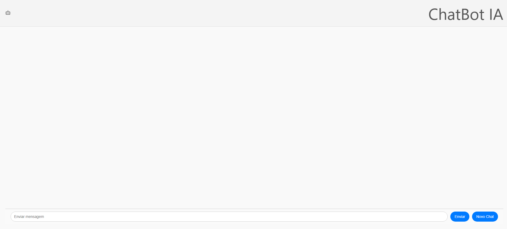

# 🤖 Chatbot IA Profissional

Interface elegante e moderna de um chatbot baseado na API da OpenAI, desenvolvido com **React + Vite**, estilização customizada em **CSS puro** e animações suaves para uma experiência imersiva e de alto padrão.



## ✨ Funcionalidades

- Interface visual refinada com foco em usabilidade.
- Comunicação em tempo real com API de chatbot.
- Scroll dinâmico da conversa com animações suaves.
- Botão para **iniciar nova conversa**.
- Layout responsivo, adaptado para qualquer tela.
- Animação visual de fundo, dando vida ao layout.

---

## 🛠️ Tecnologias Utilizadas

- ⚛️ React + Vite
- 🎨 CSS Puro (sem Tailwind)
- 🧠 OpenAI API
- 🎬 Animações com `@keyframes`
- 💡 Estrutura pensada para escalabilidade e performance

---

## 📦 Instalação e Uso

1. **Clone o repositório**

```bash
git clone https://github.com/Viniciusmqs/chatbot-openai.git
cd chatbot-openai

2. Instale as dependências

bash
Copiar
Editar
npm install

3. Rode o projeto

bash
Copiar
Editar
npm run dev

📁 Estrutura de Pastas
├── public/
│   └── logo.png
├── src/
│   ├── components/
│   │   ├── Header.jsx
│   │   ├── ChatBubble.jsx
│   │   └── ...
│   ├── App.jsx
│   ├── main.jsx
│   ├── index.css
│   └── ...
├── package.json
├── index.html
└── README.md


🔗 Autor
Desenvolvido por Vinicius Marques

